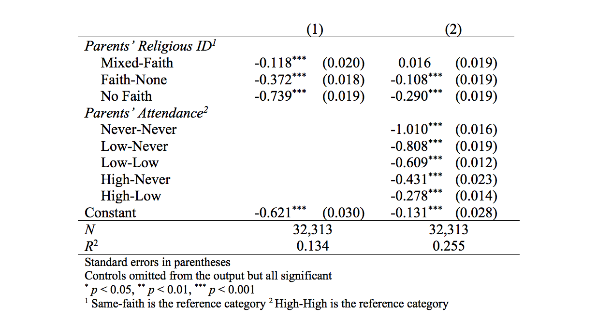

---?image=https://raw.githubusercontent.com/bmcphail05/ReligiousHeterogamy/master/map_world2.png&size=90%
### Religious Heterogamy &
### the Intergenerational
### Transmission of Religion
**A Cross-National Analysis**
 
 
_December 7, 2017_
 
 
**Brian L. McPhail**     
---
### Background
* Strong influence of parents on the religious orientations and behaviors of their children (Myers 1996; Sherkat 1998; Smith 2009).
 
 
 - Social learning: children observe and reproduce parents' behavior (Bandura 1977)
 - Family solidarity: affection and social bonds (Bengtson 2002)
---
### Religious Heterogamy

How does the religiosity of respondents with mixed-faith parents differ from respondents with same-faith parents?

* Research in US: mixed-faith parents = less religious children (Hoge 1978; Nelsen 1990; Petts & Knoester 2007)

* Cross-nationally?

---
### Data

* 2008 International Social Survey Program (ISSP) Religion III Module
  - _N_ = 59,986
  - 18 years old and older
  - Sampling: SRS or Multi-stage stratified
  - Multi-mode: face-to-face, mailed, and telephone
   
   
* Final Analysis Sample:  _n_ = 32,313
---
### Dependent Variable
* _Standardized Religiosity Scale_
  - self-id: 7-pt index (extremely, very, somewhat)
  - belief: 6-pt index (Don't believe to No doubts)
  - prayer: 11-pt index (Never" to >1/day)
  - attendance: 9-pt index (Never to >1/week)
   
   
$\mu = 0$  
$\sigma = 1$  
range = (-1.9, 1.8)
---
### Focal Independent Variables
* _Combinations of Parent Religious ID_  
Parents' rel. | %
------------ | :-------------:  
Same-Faith | 81%
Mixed-Faith | 5%
Faith-None | 7%
No Faith | 7%

* _Combinations of Parental Religious Attendance_  
using High, Low, Never
 
 
### 
Control Variables

* _Age, Education, Self-placement in Society, Female, Married, Children in household, Urban, Standardized Income_
---
### <right>Analytic Strategy</right>
* Multi-level Regression Analysis: Fixed Effects
  - Level 1: Country
  - Level 2: Individual Respondents
 
 
* Adjusts for unobserved country-level confounders that may affect both parental and respondent religiosity
* Focal IV is an individual-level (Level 2) variable

---
Table 1. FE Regression of Religiosity on Parents' Religious Heterogamy

---
### Discussion
This research project draws attention to the under-recognized impact of religious heterogamy on both religious inheritance as well as the future of religion in China. Scholars have argued that transitions in a society's religious landscape are the result of generational changes in religious affiliation, belief, and practice [@chaves1989; @sherkat2001; @crockett2006; @voas2016; @chaves2017]. These changes in religiosity across generations are directly associated with differential fertility rates of religious groups [@roof1987; @mosher1992; @hout2001; @voas2003; @pewresearchcenter2015] and the efficacy of religious socialization.

---
---?image=https://raw.githubusercontent.com/bmcphail05/ReligiousHeterogamy/master/table2a.png&size=auto 90%
